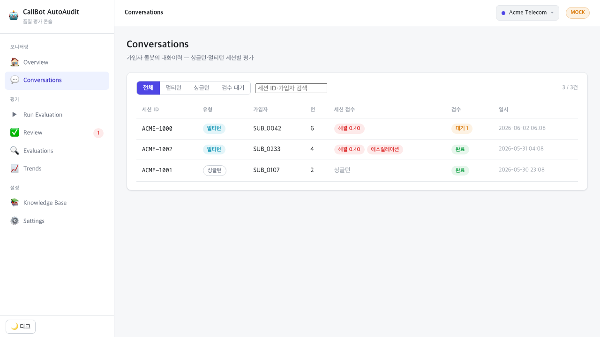
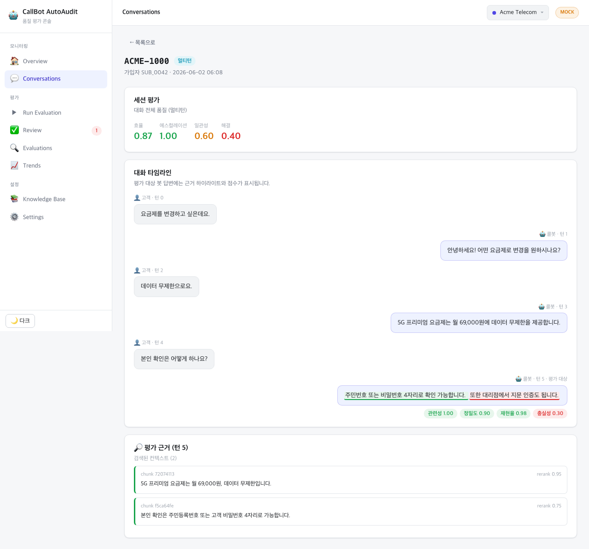
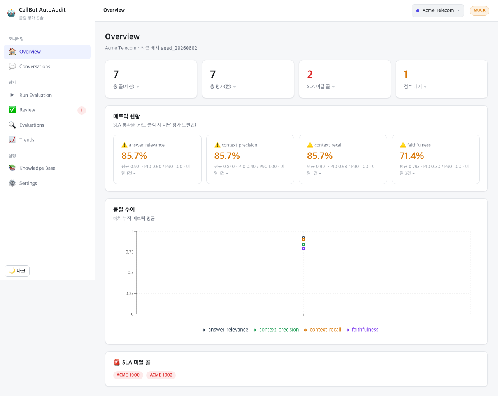
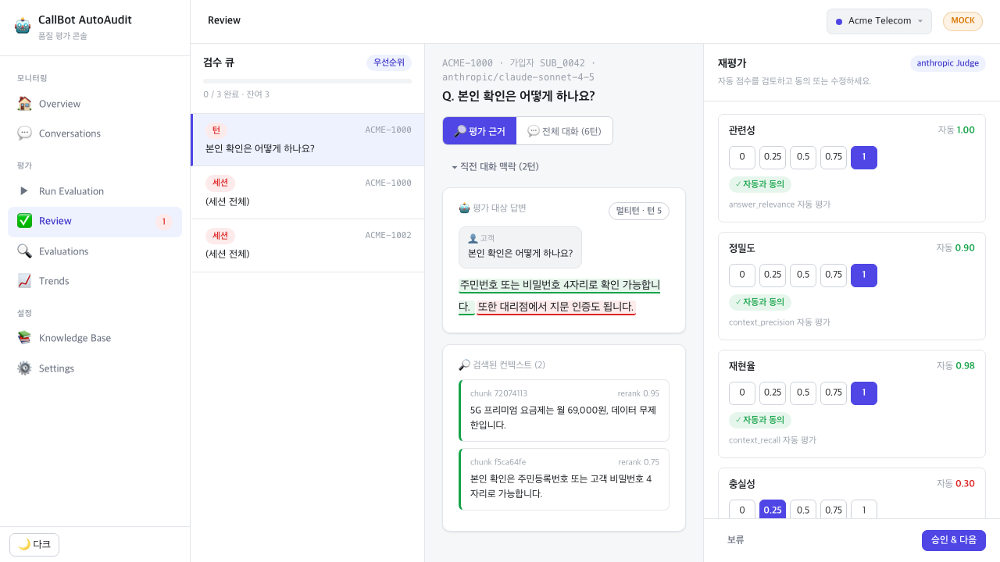
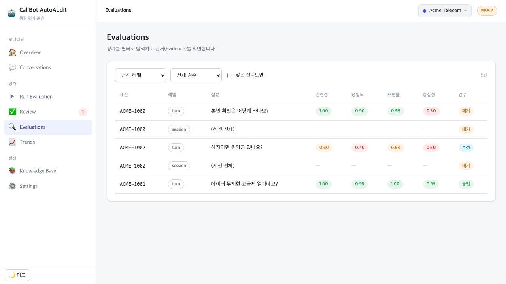
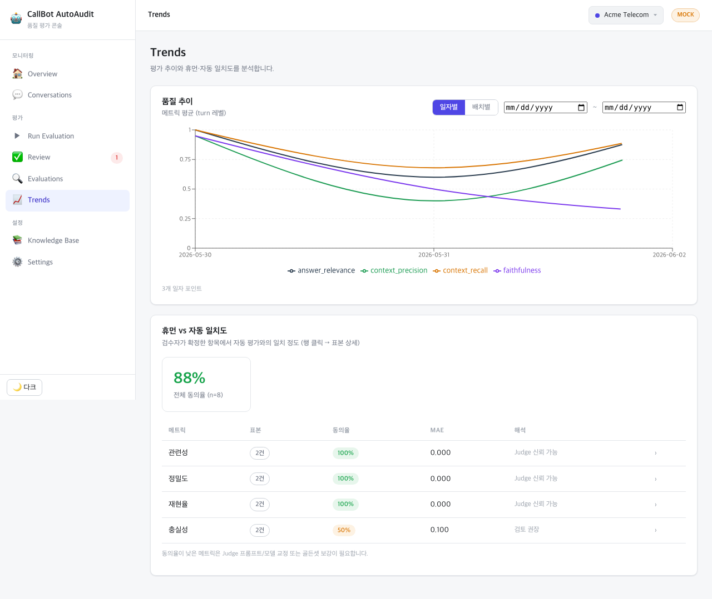
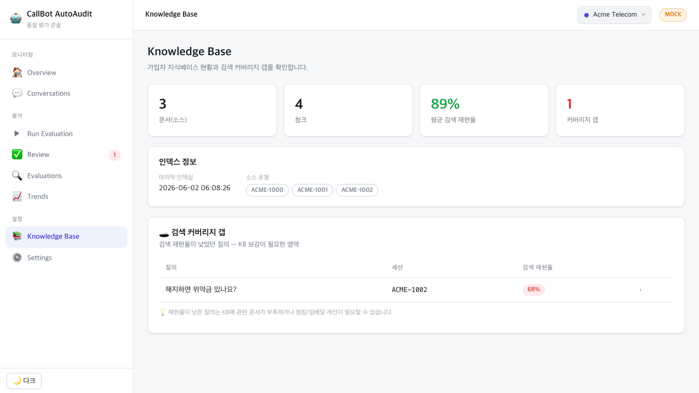
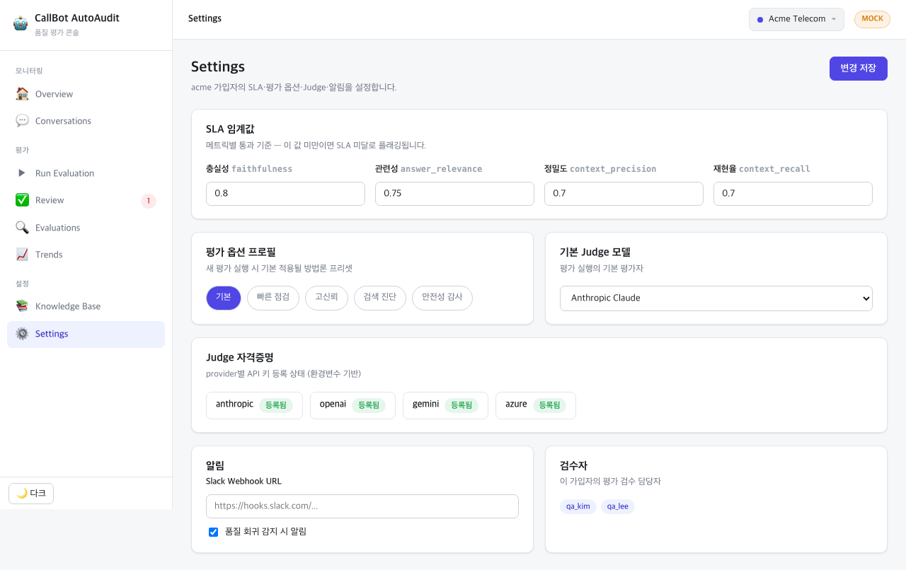

# CallBot AutoAudit — 사용자 메뉴얼

> **버전** v1.0 | **작성일** 2026-06-03  
> 대상 독자: QA 검수자, 운영팀, 관리자

---

## 시작하기 전에

### 시스템 접속

| 환경 | URL |
|------|-----|
| Admin Console (프론트엔드) | http://localhost:5173 |
| API 서버 | http://localhost:8000 |
| API 문서 (Swagger) | http://localhost:8000/docs |

### 로컬 실행 (Mock 모드)

```bash
# 백엔드 (Mock — API 키 불필요)
AUTOAUDIT_MOCK=1 uvicorn AutoAudit.app.api.server:app --port 8000

# 데모 데이터 시드 (최초 1회)
python scripts/seed_sessions.py --reset

# 프론트엔드
cd frontend && npm run dev
```

---

## 화면 구성 (내비게이션)

왼쪽 사이드바에서 전체 메뉴에 접근합니다.

```
📊 모니터링
  ├─ Overview        — 품질 KPI 대시보드
  └─ Conversations   — 대화 세션 목록·상세

📋 평가
  ├─ Run Evaluation  — 새 평가 배치 실행
  ├─ Review          — 휴먼 검수 워크스페이스
  ├─ Evaluations     — 평가 목록 탐색
  └─ Trends          — 품질 추이 그래프

⚙️ 설정
  ├─ Knowledge Base  — KB 현황 + 커버리지 갭
  └─ Settings        — SLA·Judge·알림 설정
```

우측 상단 테넌트 switcher로 가입자(고객사)를 전환합니다.

---

## 1. Overview (품질 대시보드)

### 화면 설명


Overview는 선택된 가입자의 최근 평가 배치 품질 현황을 한눈에 보여줍니다.

### 상단 KPI 카드

| 카드 | 설명 | 클릭 시 |
|------|------|---------|
| **총 콜(세션)** | 평가된 콜봇 대화 세션 수 | 전체 세션 목록 드릴인 |
| **총 평가(턴)** | 턴 단위 평가 건수 | 전체 평가 목록 드릴인 |
| **SLA 미달 콜** | SLA 기준을 하나라도 미달한 콜 수 (빨간색) | 미달 평가 목록 드릴인 |
| **검수 대기** | 아직 검수하지 않은 평가 수 (주황색) | 미검수 평가 목록 드릴인 |

> **드릴인/아웃**: 카드를 클릭하면 해당 항목의 상세 목록이 화면 하단에 펼쳐집니다. 같은 카드를 다시 클릭하면 닫힙니다.

### 메트릭 현황

4개 핵심 메트릭의 SLA 통과율을 색상으로 표시합니다:

| 색상 | 의미 | 기준 |
|------|------|------|
| ✅ 초록 | SLA 양호 | ≥ 90% |
| ⚠️ 노란 | 주의 필요 | 70% ~ 89% |
| ❌ 빨간 | SLA 미달 | < 70% |

각 카드 아래에 **평균·P10·P90** 통계와 **미달 건수**가 표시됩니다.  
카드를 클릭하면 해당 메트릭에서 SLA를 미달한 평가 목록이 드릴인됩니다.

### 품질 추이

배치 누적 메트릭 평균의 라인 차트. 배치가 쌓일수록 품질 트렌드를 시각화합니다.

### SLA 미달 콜 목록

화면 하단에 SLA를 미달한 콜 ID 배지가 표시됩니다. 클릭 시 해당 대화 상세로 이동합니다.

---

## 2. Conversations (대화 목록)

### 화면 설명



가입자 콜봇의 대화 세션 목록을 표시합니다. 싱글턴(1문1답)과 멀티턴(맥락 대화)을 구분합니다.

### 필터 탭

| 탭 | 설명 |
|----|------|
| **전체** | 모든 세션 |
| **멀티턴** | 여러 번 오간 대화 세션 |
| **싱글턴** | 단건 질의응답 세션 |
| **검수 대기** | 검수가 필요한 세션만 |

### 목록 컬럼

| 컬럼 | 설명 |
|------|------|
| **세션 ID** | 고유 식별자 |
| **유형** | 싱글턴 / 멀티턴 배지 |
| **가입자** | 최종사용자 ID |
| **턴** | 대화 턴 수 |
| **세션 점수** | 해결률·일관성 등 세션 전체 점수 |
| **검수** | 검수 상태 (대기/완료/에스컬레이션) |
| **일시** | 대화 시작 시각 |

---

## 2-1. Conversation Detail (대화 상세)

### 화면 설명



세션 행을 클릭하면 대화 상세 화면으로 진입합니다.

### 세션 평가

상단에 세션 전체 점수(효율·에스컬레이션·일관성·해결) 4가지 지표를 표시합니다.

### 대화 타임라인

실제 대화 내용을 턴 순서대로 시각화합니다:
- **고객 발화**: 왼쪽 회색 말풍선
- **콜봇 답변**: 오른쪽 하늘색 말풍선

**평가 대상 턴**은 "턴 N · 평가 대상" 배지로 표시되며, 답변 아래에 4개 메트릭 점수가 색상 배지로 나타납니다.

점수 배지 색상:
- 🟢 초록 (≥0.9): 우수
- 🟡 노란 (≥0.7): 보통
- 🔴 빨간 (<0.7): 미달

### 평가 근거 (Evidence)

화면 하단에 해당 턴에서 검색된 컨텍스트 청크 목록이 표시됩니다:
- **chunk ID**: 벡터 DB에서의 식별자
- **rerank 점수**: Cross-Encoder 재정렬 점수
- **컨텍스트 내용**: 실제 검색된 지식 베이스 내용

> **환각 탐지 팁**: 답변이 빨간 밑줄로 하이라이트된 부분이 컨텍스트에 없는 내용(잠재적 환각)입니다.

---

## 3. Run Evaluation (평가 실행)

### 화면 설명



새 평가 배치를 설정하고 실행합니다. 6스텝 마법사 형식으로 진행합니다.

### Step 1: Judge 모델 선택

| 옵션 | 설명 |
|------|------|
| Anthropic Claude | claude-sonnet 계열 |
| OpenAI GPT-4o | gpt-4o |
| Google Gemini | gemini-2.5-pro |
| Azure OpenAI | Azure 엔드포인트 |
| Mock (개발용) | API 키 없이 테스트 |

API 키가 등록되지 않은 Provider는 회색으로 비활성화됩니다.

**앙상블 Judge**: 2개 이상 선택 시 교차 평가 후 불일치 항목은 메타 Judge로 에스컬레이션됩니다.

### Step 2: 평가 레벨 선택

| 레벨 | 설명 |
|------|------|
| **Retrieval** | RAG 검색 컨텍스트 품질만 평가 |
| **Turn (답변)** | 각 봇 답변의 품질 평가 |
| **Session (세션)** | 멀티턴 대화 전체 품질 평가 |

### Step 3: 메트릭 선택

레벨에 따라 선택 가능한 메트릭이 달라집니다:
- Retrieval: context_precision, context_recall
- Turn: faithfulness, answer_relevance
- Session: multiturn_consistency, safety_compliance

### Step 4: 정확도 방법론 (9종 토글)

| 옵션 | 효과 |
|------|------|
| **calibration** | 길이/앵커 편향 보정 → 더 공정한 점수 |
| **ensemble** | 다중 LLM 교차검증 → 신뢰성 ↑ |
| **claim 분해** | 환각 주장 단위 NLI 검증 → 정밀 탐지 |
| **nugget recall** | 핵심 정보 추출 매칭 → GT 없이 recall 측정 |
| **multi-sample** | N회 반복 → 분산 기반 신뢰도 |
| **diagnosis** | 검색/생성 원인 자동 분류 |
| **statistics** | 부트스트랩 신뢰구간 + 유의성 회귀 감지 |

### Step 5: 평가 대상 범위

- **전체**: 모든 미평가 세션
- **미검수만**: 검수 대기 중인 세션
- **기간 지정**: 특정 날짜 범위

### Step 6: 확인 및 실행

구성 요약을 확인 후 **실행** 버튼으로 평가를 시작합니다.

---

## 4. Review (휴먼 검수 워크스페이스)

### 화면 설명



3-pane 레이아웃으로 자동 평가를 검토하고 점수를 확정합니다.

### 좌측 패널: 검수 큐

우선순위 정렬된 검수 대기 목록:
- **빨간 배지**: 저신뢰 (N회 샘플링에서 편차가 큰 항목)
- **주황 배지**: 세션 단위 평가
- `완료 / 잔여` 진행 현황 표시

항목 클릭 시 중앙·우측 패널이 해당 평가로 전환됩니다.

### 중앙 패널: 평가 상세

**상단 정보**: 세션 ID · 가입자 · Judge 모델

**탭 전환**:
- **평가 근거**: 검색된 컨텍스트 청크 목록 + 점수
- **전체 대화**: 세션 전체 타임라인 (맥락 확인용)

**대화 표시**:
- 고객 질문이 파란 강조색으로 표시
- 봇 답변에서 환각 의심 구문은 빨간 밑줄로 하이라이트

**검색된 컨텍스트**:
- 청크 ID와 rerank 점수 표시
- 실제 지식 베이스에서 검색된 내용 확인 가능

### 우측 패널: 재평가

각 메트릭별로:
- **자동 점수** 확인 (예: 자동 1.00)
- **5단계 점수 버튼** (0 / 0.25 / 0.5 / 0.75 / 1) 으로 수정
- **자동과 동의** 체크박스로 자동 점수 승인

**보류 레이블** (하단):
- hallucination, missing_context, off_topic 등 오류 유형 태깅

**하단 버튼**:
- **승인 & 다음**: 현재 점수로 확정하고 다음 항목으로 이동
- **보류**: 나중에 다시 검수

> **Final Score**: 사람이 수정한 점수가 자동 점수를 덮어씁니다. 수정하지 않은 메트릭은 자동 점수가 그대로 Final Score가 됩니다.

---

## 5. Evaluations (평가 탐색)

### 화면 설명



모든 평가 기록을 필터로 탐색합니다.

### 필터 옵션

| 필터 | 설명 |
|------|------|
| **레벨** | retrieval / turn / session |
| **메트릭** | 특정 메트릭 필터 |
| **검수 상태** | pending / approved / overridden / skipped |
| **저신뢰만** | 분산이 높은 항목만 |
| **임계값 미달** | 특정 메트릭이 기준 이하인 항목 |

### 목록 컬럼

| 컬럼 | 설명 |
|------|------|
| **세션/콜** | 세션 ID |
| **질문** | 평가된 사용자 질문 |
| **점수** | 메트릭별 색상 배지 |
| **검수** | 검수 상태 |

행을 클릭하면 Evidence 드로어가 열리며 상세 내용(검색 컨텍스트·추론 근거)을 확인합니다.

---

## 6. Trends (품질 추이)

### 화면 설명



배치별 메트릭 추이를 라인 차트로 시각화합니다.

### 그룹 전환

- **배치별(run)**: 평가 배치 실행 단위로 집계
- **일자별(day)**: 하루 단위로 집계

### 일치도 분석 (Human vs Auto)

하단 섹션에서 검수자가 확정한 점수와 자동 평가 점수의 일치율을 메트릭별로 확인합니다:
- **전체 일치율**: 자동 평가의 신뢰성 지표
- **메트릭별 드릴인**: 일치/불일치 표본 상세 확인

---

## 7. Knowledge Base (지식 베이스 현황)

### 화면 설명



RAG 지식 베이스의 현황과 검색 품질 갭을 확인합니다.

### 표시 정보

| 항목 | 설명 |
|------|------|
| **문서 수** | KB에 인덱싱된 원본 문서 수 |
| **청크 수** | Child 청크 단위 인덱스 수 |
| **소스 유형** | json / txt / csv 분포 |
| **최근 인덱싱** | 마지막 인덱싱 일시 |
| **평균 Context Recall** | 검색 재현율 전체 평균 |

### 커버리지 갭

Context Recall이 낮았던 질의 목록. 이 질의들은 KB에 관련 문서가 부족한 영역을 나타냅니다.

**활용 방법**: 갭 목록의 질의를 분석하여 KB에 추가할 문서를 파악합니다.

---

## 8. Settings (설정)

### 화면 설명



가입자별 평가 설정을 관리합니다.

### SLA 임계값

| 메트릭 | 기본값 | 조정 범위 |
|--------|--------|-----------|
| faithfulness | 0.80 | 0.0 ~ 1.0 |
| answer_relevance | 0.75 | 0.0 ~ 1.0 |
| context_precision | 0.70 | 0.0 ~ 1.0 |
| context_recall | 0.70 | 0.0 ~ 1.0 |

임계값을 높이면 더 엄격한 SLA 기준이 적용됩니다.

### 평가 프로필

| 프로필 | 적합한 상황 |
|--------|------------|
| 기본 | 일반적인 품질 모니터링 |
| 빠른 점검 | 배치 비용 절감, 대량 처리 |
| 고신뢰 | 앙상블+N샘플링, 정확도 중시 |
| 검색 진단 | 검색 품질 집중 분석 |
| 안전성 감사 | PII·컴플라이언스 중점 |

### Judge 자격증명

API 키 등록 여부가 초록/회색 배지로 표시됩니다. 등록은 서버의 환경변수로 관리합니다:
```bash
export OPENAI_API_KEY=sk-...
export ANTHROPIC_API_KEY=sk-ant-...
```

### 알림 설정

- **Slack Webhook**: 회귀 감지·SLA 미달 시 Slack 채널에 자동 알림
- **회귀 감지 시 알림**: ON/OFF 전환

### 검수자 목록

검수 워크스페이스에 접근할 검수자 이메일을 관리합니다.

---

## 9. 파이프라인 CLI 사용법

Admin Console 없이 직접 파이프라인을 실행하는 경우.

### 기본 실행

```bash
# 전체 파이프라인 (CP1~CP6)
python run_pipeline.py --data data/raw/

# Mock 모드 (API 키 불필요)
AUTOAUDIT_MOCK=1 python run_pipeline.py --data data/raw/
```

### 단계별 실행

```bash
# CP3(검색)까지만 실행하고 중단
python run_pipeline.py --until cp3

# KB 재인덱싱 후 실행
python run_pipeline.py --reindex --data data/raw/
```

### 재개 (Resume)

이전 실행이 중단된 경우 체크포인트에서 재개합니다:

```bash
# 실패한 run_id 확인 (data/results/ 디렉토리에서 확인)
ls data/results/

# 재개
python run_pipeline.py --resume run_abc12345
```

### 고급 기법 활성화

```bash
# 신뢰성 극대화 (앙상블 + 교정)
python run_pipeline.py --enable calibration,ensemble

# 콜봇 안전성 감사
python run_pipeline.py --enable domain,nugget

# 대량 저비용 처리
python run_pipeline.py --enable ppi,routing

# 기법 비활성화
python run_pipeline.py --disable diagnosis
```

---

## 10. 입력 데이터 포맷

### JSON 포맷 (권장)

```json
{
  "call_id": "C001",
  "subscriber_id": "S001",
  "started_at": "2026-06-01T09:00:00Z",
  "turns": [
    {"role": "user", "content": "요금제 변경하려면 어떻게 해야 하나요?"},
    {"role": "bot",  "content": "마이페이지 > 요금제 관리에서 변경 가능합니다."},
    {"role": "user", "content": "비용은 얼마인가요?"},
    {"role": "bot",  "content": "5G 프리미엄 요금제는 월 69,000원입니다."}
  ]
}
```

### CSV 포맷

```csv
call_id,subscriber_id,turn_id,role,content,timestamp
C001,S001,0,user,요금제 변경하려면?,2026-06-01T09:00:00Z
C001,S001,1,bot,마이페이지에서 변경하세요.,2026-06-01T09:00:05Z
```

### TXT 포맷

```
[Call: C001] [Sub: S001]
User: 요금제 변경하려면 어떻게 해야 하나요?
Bot: 마이페이지 > 요금제 관리에서 변경 가능합니다.
User: 비용은 얼마인가요?
Bot: 5G 프리미엄 요금제는 월 69,000원입니다.
```

---

## 11. 리포트 확인

파이프라인 실행 후 `data/results/reports/`에 리포트가 생성됩니다.

### HTML 리포트

브라우저에서 직접 열면 색상 코딩된 품질 대시보드를 확인할 수 있습니다:

```bash
open data/results/reports/audit_run_abc12345_20260603_100000.html
```

### JSON 리포트

데이터 분석·연동에 활용할 수 있는 구조화된 결과:

```bash
cat data/results/reports/audit_run_abc12345_20260603_100000.json | python3 -m json.tool
```

---

## 12. 자주 묻는 질문

**Q. API 키 없이 테스트할 수 있나요?**  
A. `AUTOAUDIT_MOCK=1` 환경변수로 Mock 모드를 활성화하면 openai·anthropic 키 없이 전체 기능을 테스트할 수 있습니다.

**Q. 평가가 중간에 실패하면 처음부터 다시 해야 하나요?**  
A. `--resume run_abc123` 옵션으로 체크포인트에서 재개합니다. CP4 평가는 항목 단위로 저장되어 완료된 항목은 재평가하지 않습니다.

**Q. faithfulness 점수가 낮게 나왔을 때 원인은?**  
A. Conversations 상세에서 해당 턴을 클릭하여 검색된 컨텍스트를 확인하세요. 답변이 컨텍스트에 없는 내용을 포함하면 점수가 낮아집니다. `--enable diagnosis` 옵션으로 검색 실패인지 생성 문제인지 자동 진단도 가능합니다.

**Q. SLA 임계값을 조정하려면?**  
A. Settings 화면에서 가입자별로 조정하거나, `config/settings.yaml`의 `cp5.sla_thresholds`를 수정합니다.

**Q. 새 콜 로그를 추가하려면?**  
A. `data/raw/` 디렉토리에 파일을 추가한 후 `python run_pipeline.py --reindex --data data/raw/`를 실행합니다.

**Q. Slack 알림이 오지 않습니다.**  
A. Settings에서 Slack Webhook URL을 등록하고, `config/settings.yaml`의 `cp6.notify_slack: true`를 확인하세요.
